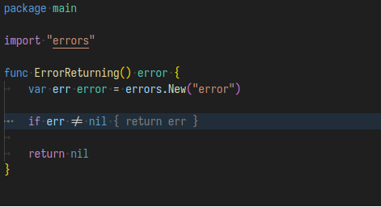
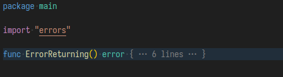
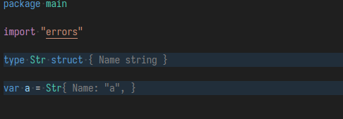

    

<h2 align="center"> Gompressor - A Golang error collapsing tool </h2>

Gompressor is a fork from [VSCode-Better-Folding](https://github.com/mtbaqer/vscode-better-folding).

It's a Go focused extension, with the intention of improving Go's overall collapsing experience.

The extension is still early-stage. Please help contributing with code or issues.

## Features

### Automatic initial error folding

When opening a file, it will automatically collapse all single line error statements.

### Showing Folded Lines Count

### Show objects preview

